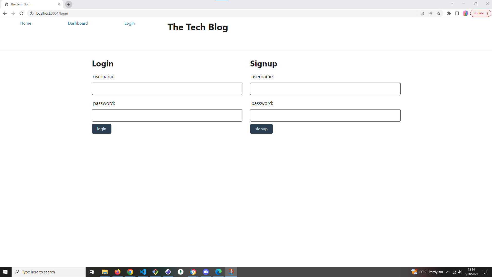

# Vacuum Tube Tech Blog

  

## Description
This is a project that uses the Model-View-Controller paradigm applied to a tech blog website. Some handlebars may have been harmed during the construction of this app.

## Table of Contents
  * [Installation](#installation)
  * [Usage](#usage)
  * [Tests](#tests)
  * [Contributing](#contributing)
  * [Credits](#credits)
  * [License](#license)
  
## Installation
  
  In the command line, run: npm i, npm start.
  
## Usage
  Dependencies required:
  * "bcrypt": "^5.1.0",
  * "connect-session-sequelize": "^7.1.7",
  * "dotenv": "^16.0.3",
  * "express": "^4.18.2",
  * "express-handlebars": "^7.0.2",
  * "express-session": "^1.17.3",
  * "mysql": "^2.18.1",
  * "mysql2": "^3.3.3",
  * "nodemon": "^2.0.22",
  * "sequelize": "^6.29.3",
  * "session": "^0.1.0"

  devDependencies:
  * "nodemon": "^2.0.22"

  
  
## Tests
  N/A
  (Optional)
  Write tests for your application if applicable. Then provide examples on how to run them here.
  
## Contributing

  The [Contributor Covenant](https://www.contributor-covenant.org/) is an industry standard, but you can always write your own if you'd prefer.

## Credits

N/A

## License:

MIT

Copyright Unknown

        Permission is hereby granted, free of charge, to any person 
        obtaining a copy of this software and associated documentation 
        files (the “Software”), to deal in the Software without restriction, 
        including without limitation the rights to use, copy, modify, 
        merge, publish, distribute, sublicense, and/or sell copies of 
        the Software, and to permit persons to whom the Software is 
        furnished to do so.
        
        THE SOFTWARE IS PROVIDED “AS IS”, WITHOUT WARRANTY OF ANY KIND, 
        EXPRESS OR IMPLIED, INCLUDING BUT NOT LIMITED TO THE WARRANTIES 
        OF MERCHANTABILITY, FITNESS FOR A PARTICULAR PURPOSE AND 
        NONINFRINGEMENT. IN NO EVENT SHALL THE AUTHORS OR COPYRIGHT 
        HOLDERS BE LIABLE FOR ANY CLAIM, DAMAGES OR OTHER LIABILITY, 
        WHETHER IN AN ACTION OF CONTRACT, TORT OR OTHERWISE, ARISING 
        FROM, OUT OF OR IN CONNECTION WITH THE SOFTWARE OR THE USE OR 
        OTHER DEALINGS IN THE SOFTWARE.

## Badges
(Optional)
Badges may be hosted by [shields.io](https://shields.io/).

## Contact Me
  * GitHub: maxr-e
  * Email: maxroyal.eisenberg@gmail.com

